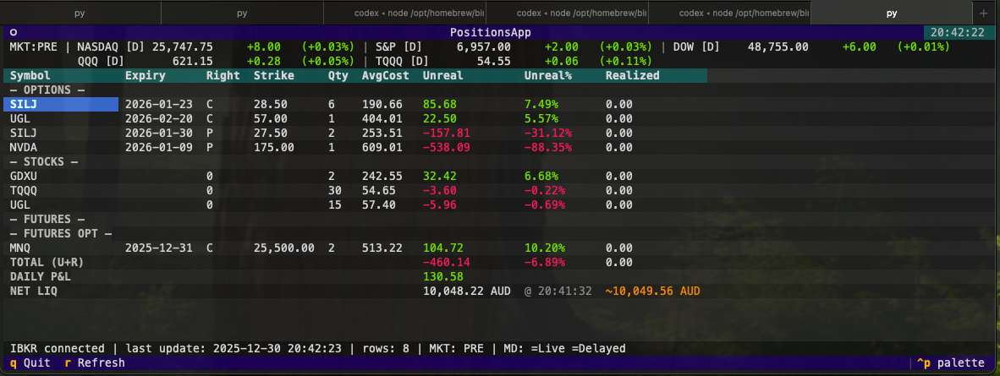
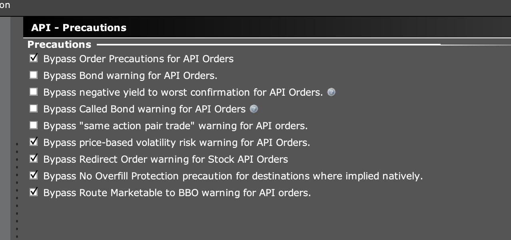
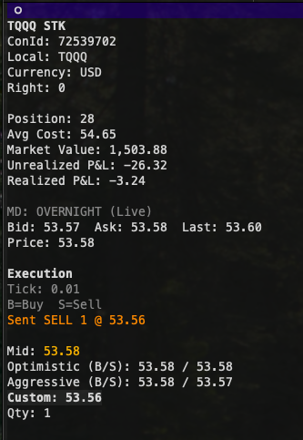

# tradebot

Minimal IBKR TUI trading client & bot



## Prerequisites
- Run **IB Gateway** (or TWS) with the API enabled.
- In **API → Precautions**, enable the bypasses below (orders can be rejected without them):
  - Bypass Order Precautions for API Orders
  - Bypass price‑based volatility risk warning for API Orders
  - Bypass Redirect Order warning for Stock API Orders
  - Bypass No Overfill Protection precaution for destinations where implied natively
  - Bypass Route Marketable to BBO warning for API orders
  - Example:
    

## Features
- Top bar with **NQ/ES/YM futures** plus **QQQ/TQQQ proxy**, session label, and live/delayed tags.
- Positions grouped by **Options / Stocks / Futures / Futures Options (FOP)**.
- **Unrealized / Realized** P&L, **Daily P&L**, and **Net Liquidation** (with last‑update timestamp and an estimate).
- Event‑driven UI refresh (redraws only on data changes, throttled to 250ms).
- **Details screen** per position with contract metadata, live quotes, and an execution panel.
- **Overnight routing** for equities during the overnight session via the `OVERNIGHT` exchange.

## Details Screen


- Contract metadata (conId, local symbol, exchange, currency, expiry/right/strike).
- Position snapshot (qty, avg cost, market value, unrealized/realized P&L).
- Market data header shows **exchange** and **Live/Delayed** status.
- Bid/Ask/Last + price line (mark/close fallback).
- **Underlying quotes** shown for OPT/FOP positions.
- **Execution panel** with tick size, mid (highlighted), optimistic/aggressive prices, custom price, and qty.
- **Hotkeys**: `B` buy, `S` sell, `j/k` or arrows to select rows, `h/l` to nudge custom price/qty, `r` to refresh market data.

## Architecture
- `tradebot/config.py` — runtime config (host/port/client id/refresh interval).
- `tradebot/client.py` — ib_insync wrapper (portfolio, market data, PnL, net liq cache).
- `tradebot/ui.py` — Textual TUI + detail screen.
- `tradebot/store.py` — in‑memory portfolio snapshot.
- `tradebot/main.py` — entrypoint.
- `tradebot/gpt/` — reserved for future GPT workflows.

## Usage
1) Run **IB Gateway** or **TWS** with the API enabled (socket 4001 by default).
2) Launch:
   ```bash
   ./bot.py
   ```

Optional env vars:
- `IBKR_HOST` (default `127.0.0.1`)
- `IBKR_PORT` (default `4001`)
- `IBKR_CLIENT_ID` (default `0`)
- `IBKR_ACCOUNT` (optional, to pin an account)

## Controls
- **Arrow keys** — navigate rows
- **Enter** — open details screen
- **b** / **Esc** — back
- **r** — hard refresh (resubscribe)
- **q** — quit

Details screen:
- **B** — send Buy
- **S** — send Sell
- **j/k** or **Up/Down** — move selection
- **h/l** or **Left/Right** — nudge price/qty or jump selection
- **r** — refresh market data for the current contract

## Notes
- `[L]` = live data, `[D]` = delayed data.
- If you don’t subscribe to real‑time market data, quotes may be delayed.
- `Net Liq` is provided by IBKR; the `~` estimate just interpolates between IBKR updates.

## Backtesting status
Backtest docs live in `tradebot/backtest/README.md` (includes spot milestone regeneration commands and sweep coverage ranges).

**Universe A — Spot strategy template coverage (current)**
- Direction layer (EMA preset/mode/confirm) + interactions with regime/permission/exits.
- Regime gates (bias + confirm) on multi-timeframe bars (e.g. 4h/1d Supertrend; optional regime2).
- Exits (fixed % and ATR, including the PT<1.0 “net-PnL pocket”) + flip-exit / hold.
- Permission gates (TOD, spread/slope, volume, RV band, cooldown/skip-open, weekdays, exit-time).
- Extra gates explored: Raschke `$TICK` width gating, ORB (15m axis).

**Universe B — Algo trading robustness (future work)**
- Realism pass (execution + costs): next-bar execution, intrabar TP/SL, spread/slippage/fees, ET day/session boundaries.
- Out-of-sample / walk-forward selection + multi-year regime diversity checks.
- Risk realism: intrabar drawdown / MAE/MFE and margin/position constraints.
