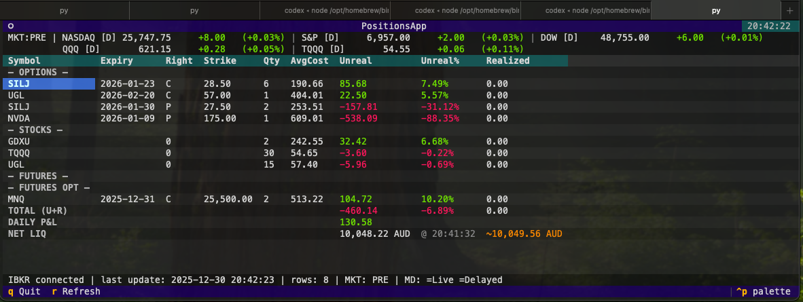
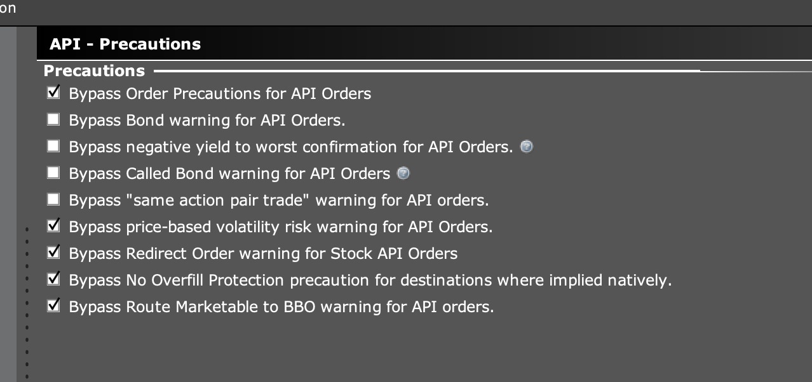
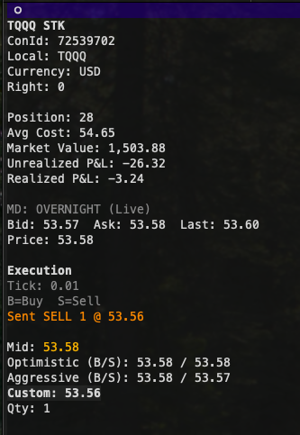

# tradebot

Minimal IBKR TUI trading client & bot



## Prerequisites
- Run **IB Gateway** (or TWS) with the API enabled.
- In **API → Precautions**, enable the bypasses below (orders can be rejected without them):
  - Bypass Order Precautions for API Orders
  - Bypass price‑based volatility risk warning for API Orders
  - Bypass Redirect Order warning for Stock API Orders
  - Bypass No Overfill Protection precaution for destinations where implied natively
  - Bypass Route Marketable to BBO warning for API orders
  - Example:
    

## Features
- Top bar with **NQ/ES/YM futures** plus **QQQ/TQQQ proxy**, session label, and live/delayed tags.
- Positions grouped by **Options / Stocks / Futures / Futures Options (FOP)**.
- **Unrealized / Realized** P&L, **Daily P&L**, and **Net Liquidation** (with last‑update timestamp and an estimate).
- Event‑driven UI refresh (redraws only on data changes, throttled to 250ms).
- **Details screen** per position with contract metadata, live quotes, and an execution panel.
- **Overnight routing** for equities during the overnight session via the `OVERNIGHT` exchange.

## Details Screen


- Contract metadata (conId, local symbol, exchange, currency, expiry/right/strike).
- Position snapshot (qty, avg cost, market value, unrealized/realized P&L).
- Market data header shows **exchange** and **Live/Delayed** status.
- Bid/Ask/Last + price line (mark/close fallback).
- **Underlying quotes** shown for OPT/FOP positions.
- **Execution panel** with tick size, mid (highlighted), optimistic/aggressive prices, custom price, and qty.
- **Hotkeys**: `B` buy, `S` sell, `j/k` or arrows to select rows, `h/l` to nudge custom price/qty, `r` to refresh market data.

## Architecture
- `tradebot/config.py` — runtime config (host/port/client id/refresh interval).
- `tradebot/client.py` — ib_insync wrapper (portfolio, market data, PnL, net liq cache).
- `tradebot/ui/app.py` — Textual application shell and navigation.
- `tradebot/ui/portfolio/` — portfolio search, account table, and market-value presentation.
- `tradebot/ui/position_detail/` — position detail, charts, market context, and order controls.
- `tradebot/engines/` — shared market, signal, risk, shock, and execution truth.
- `tradebot/spot/` — canonical spot payload, policy, sizing, graph, and lifecycle semantics.
- `tradebot/backtest/cache_ops/` — cache coverage, repair, resampling, sync, and CLI orchestration.
- `tradebot/store.py` — in‑memory portfolio snapshot.
- `tradebot/main.py` — entrypoint.
- `tradebot/gpt/` — reserved for future GPT workflows.

## Usage
1) Run **IB Gateway** or **TWS** with the API enabled (socket 4001 by default).
2) Launch:
   ```bash
   ./bot.py
   ```

Optional env vars:
- `IBKR_HOST` (default `127.0.0.1`)
- `IBKR_PORT` (default `4001`)
- `IBKR_CLIENT_ID` (seed, default `500`)
- `IBKR_PROXY_CLIENT_ID` (seed, default `IBKR_CLIENT_ID + 1`)
- `IBKR_ACCOUNT` (optional, to pin an account)
- `IBKR_CLIENT_ID_POOL_START` (default `500`)
- `IBKR_CLIENT_ID_POOL_END` (default `899`)
- `IBKR_CLIENT_ID_BURST_ATTEMPTS` (default `8`)
- `IBKR_CLIENT_ID_BACKOFF_INITIAL_SEC` (default `5.0`)
- `IBKR_CLIENT_ID_BACKOFF_MAX_SEC` (default `300.0`)
- `IBKR_CLIENT_ID_BACKOFF_MULTIPLIER` (default `2.0`)
- `IBKR_CLIENT_ID_BACKOFF_JITTER_RATIO` (default `0.15`)
- `IBKR_CLIENT_ID_STATE_FILE` (default `${TMPDIR:-/tmp}/tradebot_ib_client_ids.json`)

## Controls
- **Arrow keys** — navigate rows
- **Enter** — open details screen
- **b** / **Esc** — back
- **r** — hard refresh (resubscribe)
- **q** — quit

Details screen:
- **B** — send Buy
- **S** — send Sell
- **j/k** or **Up/Down** — move selection
- **h/l** or **Left/Right** — nudge price/qty or jump selection
- **r** — refresh market data for the current contract

## Notes
- `[L]` = live data, `[D]` = delayed data.
- If you don’t subscribe to real‑time market data, quotes may be delayed.
- `Net Liq` is provided by IBKR; the `~` estimate just interpolates between IBKR updates.

## Backtesting status
Backtest docs live in `tradebot/backtest/README.md` (includes spot milestone regeneration commands and sweep coverage ranges).

**Universe A — Spot strategy template coverage (current)**
- Direction layer (EMA preset/mode/confirm) + interactions with regime/permission/exits.
- Regime gates (bias + confirm) on multi-timeframe bars (e.g. 4h/1d Supertrend; optional regime2).
- Exits (fixed % and ATR, including the PT<1.0 “net-PnL pocket”) + flip-exit / hold.
- Permission gates (TOD, spread/slope, volume, RV band, cooldown/skip-open, weekdays, exit-time).
- Extra gates explored: Raschke `$TICK` width gating, ORB (15m axis).

**Universe B — Algo trading robustness (future work)**
- Realism pass (execution + costs): next-bar execution, intrabar TP/SL, spread/slippage/fees, ET day/session boundaries.
- Out-of-sample / walk-forward selection + multi-year regime diversity checks.
- Risk realism: intrabar drawdown / MAE/MFE and margin/position constraints.

<!-- BEGIN: TRADEBOT_CAPABILITY_PYRAMID -->

## Capability Pyramid And MECC Ledger

Machine source: `tests/ledgers/capability_contracts.json`. Every test file has one primary MECC owner.

### Run profiles

| Profile | Command |
| --- | --- |
| Deterministic | `python -m pytest -q` |
| Ledger structure | `python -m pytest tests/test_capability_contracts.py -q` |
| Explicit IB canary | `TRADEBOT_RUN_LIVE_IB_GATEWAY=1 python -m pytest -o addopts='' -m live tests/live/test_ib_gateway_tunnel.py -q` |

Live safety: the canary performs direct TCP inspection and disposable SSH forwarding to Mac `127.0.0.1:4001`; it preserves localhost-only `TrustedIPs` and submits no orders or market-data subscriptions.

### MECC subsystem index

| Subsystem | Family | Purpose |
| --- | --- | --- |
| `runtime-configuration-state` | `shared` | Own startup configuration, environment parsing, knobs, presets, persistent runtime identity, and reproducible launch state. |
| `market-time-series-semantics` | `shared` | Own canonical timestamps, calendars, sessions, bar completeness, resampling meaning, and shared series identity. |
| `signal-regime-intelligence` | `shared` | Own market observation, feature extraction, signal snapshots, regime routing, shock detection, and context requirements. |
| `policy-risk-sizing` | `shared` | Own action decisions derived from market facts: hold, enter, exit, resize, risk overlays, limits, and quantities. |
| `market-realism-parity` | `shared` | Own executable receipts proving simulated and live-intended semantics agree under realistic market and broker conditions. |
| `broker-connectivity-account` | `live` | Own IB Gateway transport/session lifecycle, client IDs, reconnects, managed accounts, portfolio, account values, and broker PnL truth. |
| `live-market-data-contracts` | `live` | Own contract qualification/search, exchange identity, subscriptions, quote provenance, freshness, delayed/frozen modes, and tick increments. |
| `live-execution-orders` | `live` | Own executable orders, pricing, submission, modification, cancellation, reconciliation, fill progression, repricing, and recovery. |
| `operator-ui-observability` | `live` | Own Textual presentation, controls, status surfaces, journal output, notices, layout, and operator-visible causal truth. |
| `backtest-data-cache` | `backtest` | Own historical acquisition, cache keys and provenance, coverage, gap repair, stitching, persistence, and efficient reuse. |
| `backtest-simulation-accounting` | `backtest` | Own simulated order/fill progression, trade lifecycle, equity/PnL accounting, summaries, and deterministic replay results. |
| `research-optimization-calibration` | `research` | Own sweeps, fingerprints, parameter search, calibration, scenario comparison, predictive mining, and champion selection. |
| `verification-capability-evolution` | `verification` | Own the MECC registry, structural validation, evidence ownership, explicit live canaries, benchmark results, and future-capability promotion. |

### Capability contract index

| Layer | Status | Contract ID | Subsystem |
| --- | --- | --- | --- |
| `unit` | `covered` | `unit.runtime.configuration-state` | `runtime-configuration-state` |
| `unit` | `covered` | `unit.market.time-series-semantics` | `market-time-series-semantics` |
| `unit` | `covered` | `unit.signal.regime-intelligence` | `signal-regime-intelligence` |
| `unit` | `covered` | `unit.policy.risk-sizing` | `policy-risk-sizing` |
| `integration-replay` | `covered` | `integration.replay.market-realism-parity` | `market-realism-parity` |
| `unit` | `covered` | `unit.broker.connectivity-account` | `broker-connectivity-account` |
| `unit` | `covered` | `unit.live.market-data-contracts` | `live-market-data-contracts` |
| `unit` | `covered` | `unit.live.execution-orders` | `live-execution-orders` |
| `unit` | `covered` | `unit.operator.ui-observability` | `operator-ui-observability` |
| `unit` | `covered` | `unit.backtest.data-cache` | `backtest-data-cache` |
| `integration-replay` | `covered` | `integration.replay.backtest.simulation-accounting` | `backtest-simulation-accounting` |
| `unit` | `covered` | `unit.research.optimization-calibration` | `research-optimization-calibration` |
| `unit` | `planned` | `unit.verification.capability-ledger` | `verification-capability-evolution` |
| `e2e-live` | `covered` | `e2e.live.ib-gateway-ssh-tunnel` | `broker-connectivity-account` |
| `e2e-live` | `covered` | `e2e.live.ib-gateway-direct-transport` | `broker-connectivity-account` |
| `benchmark` | `planned` | `benchmark.future.live-backtest-drift-score` | `market-realism-parity` |
| `unit` | `planned` | `unit.future.content-addressed-cache-provenance` | `backtest-data-cache` |
| `integration-replay` | `planned` | `integration.replay.future.queue-latency-partial-fill-model` | `backtest-simulation-accounting` |
| `benchmark` | `planned` | `benchmark.future.walk-forward-overfit-defence` | `research-optimization-calibration` |
| `integration-provider` | `planned` | `integration.provider.future.entitlement-freshness-sla` | `live-market-data-contracts` |
| `e2e-live` | `planned` | `e2e.live.future.shadow-order-digital-twin` | `live-execution-orders` |
| `benchmark` | `planned` | `benchmark.future.online-regime-drift-calibration` | `signal-regime-intelligence` |
| `unit` | `planned` | `unit.future.account-constraint-aware-sizing` | `policy-risk-sizing` |
| `integration-replay` | `planned` | `integration.replay.future.causal-replay-journal` | `operator-ui-observability` |
| `e2e-live` | `planned` | `e2e.live.future.tunnel-supervisor-failover` | `broker-connectivity-account` |
| `integration-replay` | `planned` | `integration.replay.future.corporate-actions-roll-adjustments` | `market-time-series-semantics` |
| `unit` | `planned` | `unit.future.reproducible-runtime-manifest` | `runtime-configuration-state` |
| `benchmark` | `planned` | `benchmark.future.current-market-canary-dashboard` | `verification-capability-evolution` |

<!-- END: TRADEBOT_CAPABILITY_PYRAMID -->
